### JVM探究


- 请你谈谈你对JVM的理解？java8虚拟机和之前的变化和更新？
  - ​	首先JVM由类装载器，运行时数据区域，执行引擎，本地接口库和本地方法库组成。
- 什么是OOM，什么是栈溢出StackOVerFlowError？ 怎么分析
- JVM的常用调优参数有哪些
- 内存快照如何抓取，怎么分析Dump文件？知道吗？
- 谈谈JVM中，类加载器你的认识？ rt-jar ext application


#### 1、JVM的位置

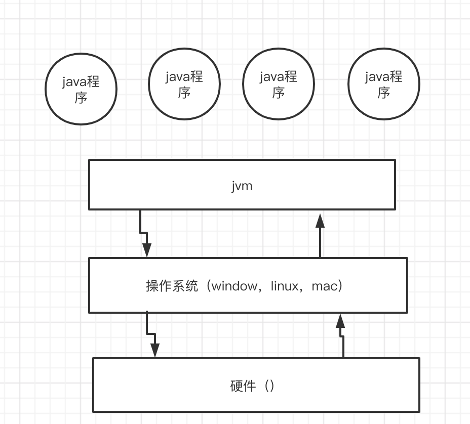

#### 2、JVM的体系结构

- 大多数[JVM](https://www.breakyizhan.com/javamianshiti/2830.html)将内存分配为Method Area(方法区)、Heap(堆)、Program Counter Register(程序计数器)、JAVA Method Stack(JAVA方法栈)、Native Method Stack(本地方法栈)。

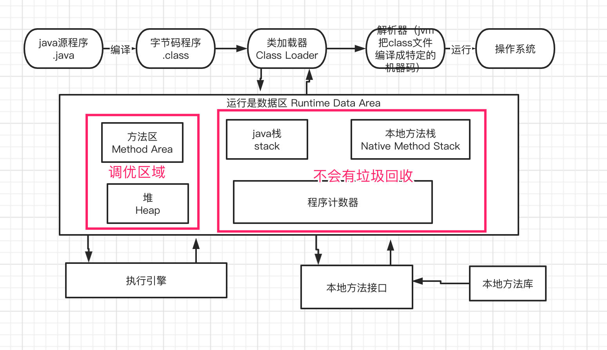

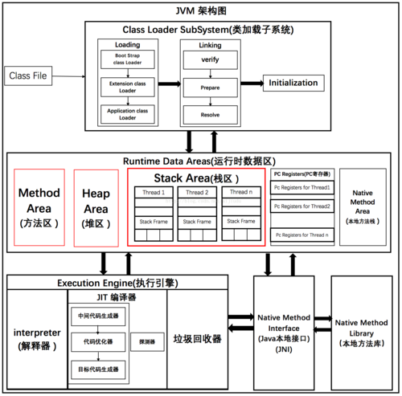

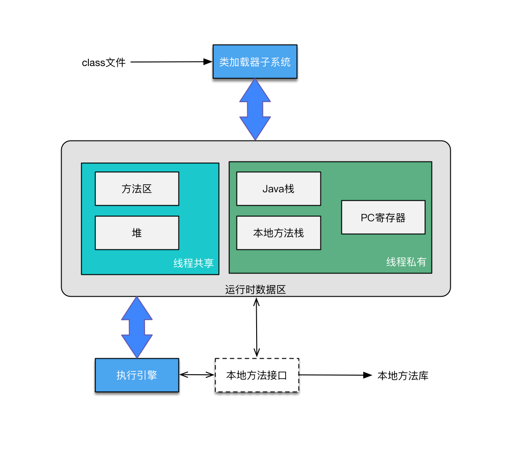


#### 3、类加载器

> 对象实例化过程

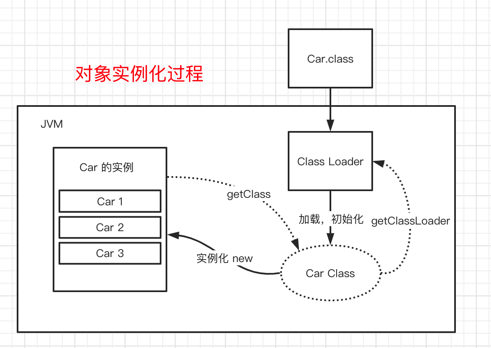

> 类加载器类别

##### BootstrapClassLoader（启动类加载器）

`c++`编写，加载`java`核心库 `java.*`,构造`ExtClassLoader`和`AppClassLoader`。由于引导类加载器涉及到虚拟机本地实现细节，开发者无法直接获取到启动类加载器的引用，所以不允许直接通过引用进行操作

##### ExtClassLoader （标准扩展类加载器）

`java`编写，加载扩展库，如`classpath`中的`jre` ，`javax.*`或者
`java.ext.dir` 指定位置中的类，开发者可以直接使用标准扩展类加载器。

##### AppClassLoader（系统类加载器）

```
java`编写，加载程序所在的目录，如`user.dir`所在的位置的`class
```

##### CustomClassLoader（用户自定义类加载器）

`java`编写,用户自定义的类加载器,可加载指定路径的`class`文件

```java
package com.javniuniu.classloader;

/**
 *
 */
public class Car {
    public static void main(String[] args) {
        Car car1 = new Car();
        Car car2 = new Car();
        Car car3 = new Car();

        System.out.println(car1.getClass());
        System.out.println(car2.getClass());
        System.out.println(car3.getClass());

        ClassLoader classLoader = car1.getClass().getClassLoader();

        System.out.println(classLoader); // AppClassLoader 应用加载器
        System.out.println(classLoader.getParent()); // ext 扩展类加载器
        System.out.println(classLoader.getParent().getParent()); // null java 程序获取不到


    }
}
```


#### 4、双亲委派机制

- 当某个类加载器需要加载某个`.class`文件时，它首先把这个任务委托给他的上级类加载器，递归这个操作，如果上级的类加载器没有加载，自己才会去加载这个类

```java
package java.lang;

public class String {
    /**
     * 双亲委派机制：安全
     * 1、APP --> EXT --> BOOT(最终执行)
     * BOOT
     * EXC
     * APP
     */

    @Override
    public String toString() {
        return "hello";
    }

    public static void main(String[] args) {
        String str = new String();
        str.toString();
        /**
         * Error: Main method not found in class java.lang.String, please define the main method as:
         *    public static void main(String[] args)
         * or a JavaFX application class must extend javafx.application.Application
         */
    }

    /**
     * 1、类加载器收到类加载器的请求
     * 2、将这个请求向上委托给父类加载器区完成，一直向上委托，直到启动类加载器
     * 3、启动加载器检查是否能够加载当前这个类，能加载就结束，使用当前的类加载器，否则，抛出一次，通知子加载器进行加载
     * 4、重复步骤3
     *
     * 如果都找不到 Class Not Found
     */
}
```


##### 委派机制的流程图

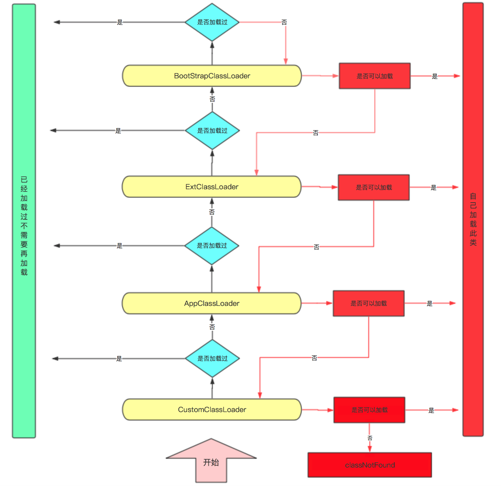

##### 双亲委派机制的作用

1、__防止重复加载__同一个`.class`。通过委托去向上面问一问，加载过了，就不用再加载一遍。保证数据安全。
2、__保证核心`.class`不能被篡改__。通过委托方式，不会去篡改核心`.clas`，即使篡改也不会去加载，即使加载也不会是同一个`.class`对象了。不同的加载器加载同一个`.class`也不是同一个`Class`对象。这样保证了`Class`执行安全


#### 5、沙箱安全机制

- 我们平时说Java是安全的，可以使用户免受自已程序的侵犯，这是因为Java提供了一个“沙箱”机制，这个“沙箱”基本组件包括如下4部分：

#####  1、类装载器
在Java沙箱中，类装载体系结构是第一道防线，可以防止自已代码去干扰正常程序代码，这是通过由不同的类装载器装入的类提供不同的命名空间来实现的。命名空间由一系列唯一的名称组成，每一个被装载的类都有不同的命名空间是由Java虚拟机为每一个类装载器维护的。

类装载器体系结构在三个方面对java的沙箱起作用

1）它防止恶意代码区干涉善意的代码
2）它守护了被信任的类库边界
3）它将代码归入保护域，该域确定了代码可以进行哪些操作。

##### 2、Class文件检验器

Class文件检验器保证装载的class文件内容的内部结构的正确，并且这些class文件相互协调一致。
Class文件检验器实现的安全目标之一就是程序的健壮性，JAVA虚拟机的class文件检验器要进行四趟扫描来完成它的操作：

第一趟：此次扫描是在类被装载的时候进行的，在这次扫描中，class文件检验器检查这个class文件的内部结构，以确保它能够被安全的编译。
第四趟：这次扫描是在进行动态连接的过程中解析符号引用时进行的，在这次扫描中，class文件检验器确认被引用的类、字段以及方法确实存在。
##### 3、 内置于Java虚拟机的安全特性
Java虚拟机装载一个类，并且对它进行了第一到第三趟的class文件检验，这些字节码就可以运行了。除了对符号引用的检验，Java虚拟机在执行字节码时还进行其他一些内置的安全机制的操作。这些机制大多数是java的类型安全的基础，它们作为java语言程序健壮性的特性。

1、类型安全的引用转换
2、结构化的内存访问
3、 自动垃圾收集
4、 数组边界检查
5、空引用检查
#####  4、安全管理及Java API
Java安全模型的前三个组成部分——类装载器体系结构，class文件检验器及java中的内置安全特性一起达到一个共同的目的：保持java虚拟机的实例和它正在运行的应用程序的内部完整性，使得它们不被恶意代码侵犯。
相反，这个安全模型的第四个组成部分是安全管理器，它主要用于保护虚拟机的外部资源不被虚拟机内运行的恶意代码侵犯。这个安全管理器是一个单独的对象，在运行的java虚拟机中，它在访问控制对于外部资源的访问中起中枢的作用。


#### 6、Native

凡事带了 native 关键字的，说明java的作用访问达不到，会去调用底层C语言的库 （ext）

会进入本地方法栈

会调用本地方法接口（JNI）

JNI 扩展java的使用，融合不同的编程语言为java所用，最初 C，C++

它在内存区域中专门开辟了一块标记区域：Native Method Stack,登记 native 方法

会在最终执行的时候，加载本地方法库中的方法，通过JNI

比如：java驱动打印机，

```java
public native void start0();
```


#### 7、PC寄存器

1. PC寄存器（ PC register ）：__每个线程启动的时候，都会创建一个PC（Program Counter，程序计数器）寄存器__。PC寄存器里保存有当前正在执行的JVM指令的地址。 每一个线程都有它自己的PC寄存器，也是该线程启动时创建的。保存下一条将要执行的指令地址的寄存器是 ：PC寄存器。PC寄存器的内容总是指向下一条将被执行指令的地址，这里的地址可以是一个本地指针，也可以是在方法区中相对应于该方法起始指令的偏移量。

2. 每个线程都有一个程序计数器，__是线程私有的__,就是一个指针，指向方法区中的方法字节码（用来存储指向下一条指令的地址,也即将要执行的指令代码），由执行引擎读取下一条指令，是一个非常小的内存空间，几乎可以忽略不记。

3. 这块内存区域很小，它是当前线程所执行的字节码的行号指示器，字节码解释器通过改变这个计数器的值来选取下一条需要执行的字节码指令。

4. 如果执行的是一个Native方法，那这个计数器是空的


#### 8、 方法区

__线程共享__，存储已经被虚拟机加载的__类信息、常量、静态变量__、即时编译器编译后的代码等等。（HotSpot虚拟机上开发部署人员更愿意成为“永久代”，Permanent Generation）。示意图如下，下面的图片显示的是JVM加载类的时候，方法区存储的信息

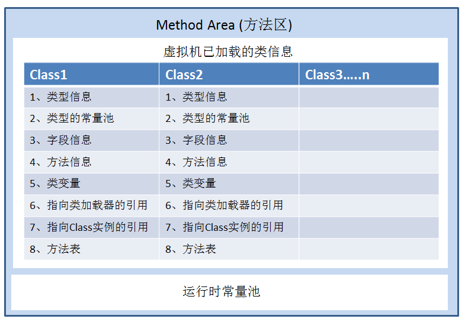

##### 1、类型信息

- 类型的全限定名
- 超类的全限定名
- 直接超接口的全限定名
- 类型标志（该类是类类型还是接口类型）
- 类的访问描述符（public、private、default、abstract、final、static）

##### 2、类型的常量池

存放该类型所用到的常量的有序集合，包括直接常量（如字符串、整数、浮点数的常量）和对其他类型、字段、方法的符号引用。常量池中每一个保存的常量都有一个索引，就像数组中的字段一样。因为常量池中保存中所有类型使用到的类型、字段、方法的字符引用，所以它也是动态连接的主要对象（在动态链接中起到核心作用）。

##### 3、字段信息（该类声明的所有字段）

- 字段修饰符（public、protect、private、default）
- 字段的类型
- 字段名称

##### 4、方法信息

方法信息中包含类的所有方法，每个方法包含以下信息：

- 方法修饰符
- 方法返回类型
- 方法名
- 方法参数个数、类型、顺序等
- 方法字节码
- 操作数栈和该方法在栈帧中的局部变量区大小
- 异常表

##### 5、类变量（静态变量）

指该类所有对象共享的变量，即使没有任何实例对象时，也可以访问的类变量。它们与类进行绑定。

##### 6、 指向类加载器的引用

每一个被JVM加载的类型，都保存这个类加载器的引用，类加载器动态链接时会用到。

##### 7、指向Class实例的引用

类加载的过程中，虚拟机会创建该类型的Class实例，方法区中必须保存对该对象的引用。通过Class.forName(String className)来查找获得该实例的引用，然后创建该类的对象。

##### 8、方法表

为了提高访问效率，JVM可能会对每个装载的非抽象类，都创建一个数组，数组的每个元素是实例可能调用的方法的直接引用，包括父类中继承过来的方法。这个表在抽象类或者接口中是没有的，类似C++虚函数表vtbl。

##### 9、运行时常量池(Runtime Constant Pool)

Class文件中除了有类的版本、字段、方法、接口等描述信息外，还有一项信息是常量池，用于存放编译器生成的各种字面常量和符号引用，这部分内容被类加载后进入方法区的运行时常量池中存放。

运行时常量池相对于Class文件常量池的另外一个特征具有动态性，可以在运行期间将新的常量放入池中（典型的如String类的intern()方法）。


> 实例化对象，jvm中的数据结构

```java
public class Teacher {
    private int id;
    private String name = "niu";

    public static void main(String[] args) {
        Teacher teacher1 = new Teacher();
        teacher1.id = 001;
        teacher1.name = "min1";

        Teacher teacher2 = new Teacher();
        teacher2.id = 002;
        teacher2.name = "min2";
    }
}
```

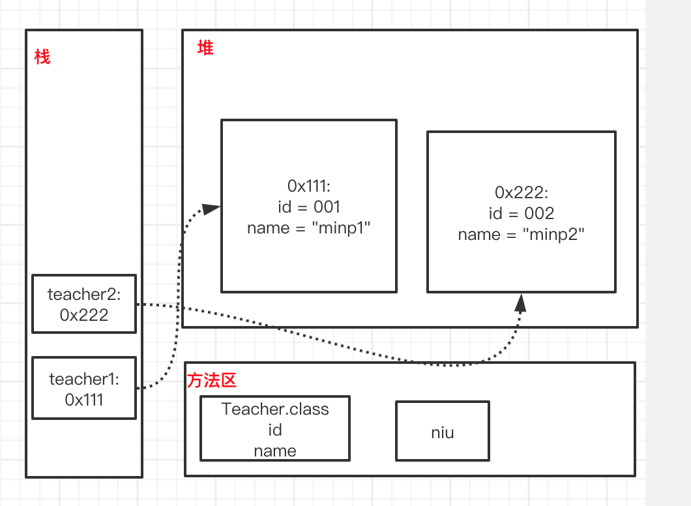


#### 9、栈

栈是运行时的单位，Java 虚拟机栈，__线程私有__，__生命周期和线程一致__。描述的是 Java 方法执行的内存模型：每个方法在执行时都会创建一个栈帧(Stack Frame)用于存储局部变量表、操作数栈、动态链接、方法出口等信息。每一个方法从调用直至执行结束，就对应着一个栈帧从虚拟机栈中入栈到出栈的过程。

__局部变量表__：存放了编译期可知的各种__基本类型__(boolean、byte、char、short、int、float、long、double)、__对象引用__(reference 类型)和__ returnAddress 类型__(指向了一条字节码指令的地址)

>  栈内存结构

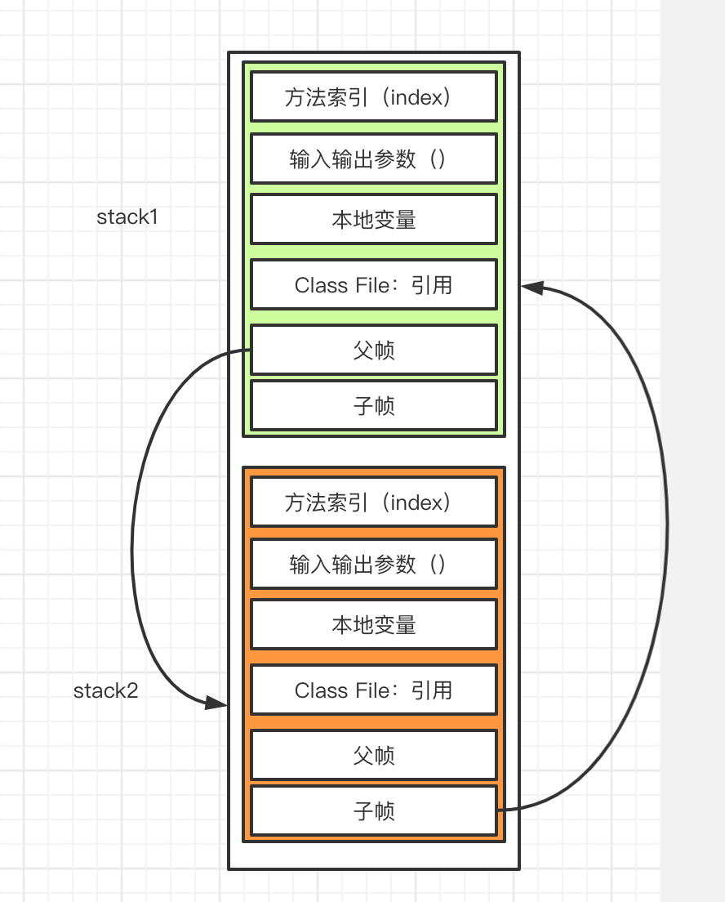


>  对象实例化过程

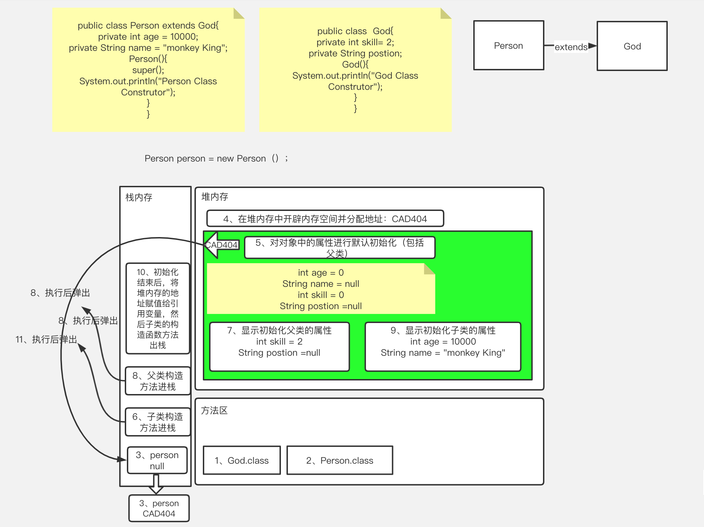


#### 10、三种JVM

大多使用` Java HotSpot(TM) 64-Bit Server VM (build 25.241-b07, mixed mode)`

#### 11、堆

__持久代/永久区__：

包括__方法区__这个区域常驻内存的，用来存放JDK自身携带的Class对象，Interface元数据，存储的是java运行时的一些环境或类信息，这个区域不存在垃圾回收，关闭VM虚拟机就可以释放这个区域的内存

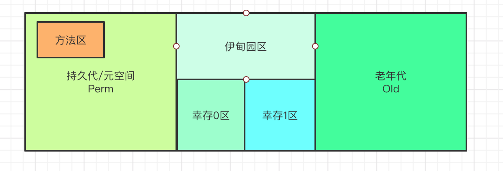


JVM内存中最大的一块，是所有__线程共享的区域__，在JVM启动时创建，唯一目的就是__用来存储对象实例__的，也被称为GC堆，因为这是垃圾收集器

管理的主要区域。Java堆还可分为：__新生代__和__老年代__，其中新生代还可再分为：Eden：From Survivor：To Survivor = 8:1:1

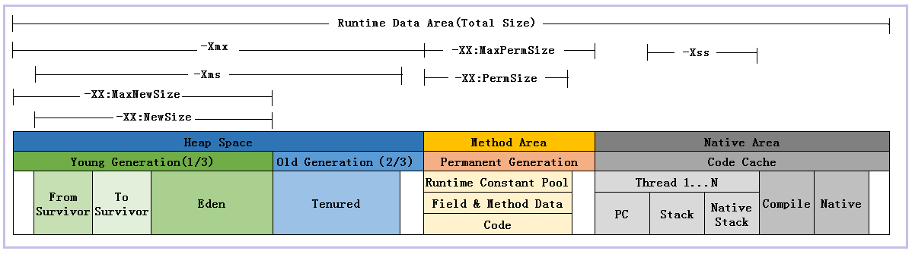

__控制参数__
-Xms设置堆的最小空间大小。

-Xmx设置堆的最大空间大小。

-XX:NewSize设置新生代最小空间大小。

-XX:MaxNewSize设置新生代最大空间大小。

-XX:PermSize设置永久代最小空间大小。

-XX:MaxPermSize设置永久代最大空间大小。

-Xss设置每个线程的堆栈大小。


> 调节堆使用

```java
package com.javniuniu.classloader;


public class MemoryDemo {
    public static void main(String[] args) {
        // 返回jvm运行时最大内存
        long maxMemory = Runtime.getRuntime().maxMemory();
        // 返回jvm初始化总内存
        long totalMemory = Runtime.getRuntime().totalMemory();

        System.out.println("max= "+maxMemory+" 字节 "+maxMemory/1024/1024+"M");
        System.out.println("total= "+maxMemory+" 字节 "+totalMemory/1024/1024+"M");

        // 当出现 OOM 异常
            // 1、尝试扩大内存看几多
            // 2、分析内存，看一下哪个地方出现类问题（专业工具）

        // GC 调优命令
        // -Xms1024m -Xmx1024m -XX:+PrintGCDetails

        /**
         * max= 1029177344 字节 981M
         * total= 1029177344 字节 981M
         * Heap
         *  PSYoungGen      total 305664K, used 15729K [0x00000007aab00000, 0x00000007c0000000, 0x00000007c0000000)
         *   eden space 262144K, 6% used [0x00000007aab00000,0x00000007aba5c420,0x00000007bab00000)
         *   from space 43520K, 0% used [0x00000007bd580000,0x00000007bd580000,0x00000007c0000000)
         *   to   space 43520K, 0% used [0x00000007bab00000,0x00000007bab00000,0x00000007bd580000)
         *  ParOldGen       total 699392K, used 0K [0x0000000780000000, 0x00000007aab00000, 0x00000007aab00000)
         *   object space 699392K, 0% used [0x0000000780000000,0x0000000780000000,0x00000007aab00000)
         *  Metaspace       used 2954K, capacity 4496K, committed 4864K, reserved 1056768K
         *   class space    used 322K, capacity 388K, committed 512K, reserved 1048576K
         *
         * Process finished with exit code 0
         */
    }
}
```


GC 垃圾回收，主要是在伊甸园区和养老区

假设内存满了，出现OOM 堆内存溢出

> GC 垃圾回收过程 和 OOM 堆内存溢出

```java
package com.javniuniu.classloader;

import java.util.Random;

// -Xms8m -Xmx8m -XX:+PrintGCDetails
public class Hello {
    public static void main(String[] args) {
        String str = "javaniuniujavaniuniu";
        while (true) {
            str += str + new Random().nextInt(999999999) + new Random().nextInt(999999999);
        }
        /**
         * [GC (Allocation Failure) [PSYoungGen: 1516K->482K(2048K)] 1516K->522K(7680K), 0.0010070 secs] [Times: user=0.00 sys=0.00, real=0.00 secs]
         * [GC (Allocation Failure) [PSYoungGen: 1839K->487K(2048K)] 1879K->735K(7680K), 0.0010057 secs] [Times: user=0.00 sys=0.00, real=0.00 secs]
         * [GC (Allocation Failure) [PSYoungGen: 1747K->511K(2048K)] 1995K->879K(7680K), 0.0007348 secs] [Times: user=0.01 sys=0.01, real=0.00 secs]
         * [GC (Allocation Failure) [PSYoungGen: 1462K->320K(2048K)] 3043K->2205K(7680K), 0.0006422 secs] [Times: user=0.00 sys=0.00, real=0.00 secs]
         * [Full GC (Ergonomics) [PSYoungGen: 1675K->0K(2048K)] [ParOldGen: 5526K->3403K(5632K)] 7202K->3403K(7680K), [Metaspace: 3037K->3037K(1056768K)], 0.0049794 secs] [Times: user=0.02 sys=0.00, real=0.00 secs]
         * [GC (Allocation Failure) --[PSYoungGen: 1283K->1283K(2048K)] 5901K->5901K(7680K), 0.0009396 secs] [Times: user=0.00 sys=0.00, real=0.00 secs]
         * [Full GC (Ergonomics) [PSYoungGen: 1283K->0K(2048K)] [ParOldGen: 4617K->2797K(5632K)] 5901K->2797K(7680K), [Metaspace: 3044K->3044K(1056768K)], 0.0038085 secs] [Times: user=0.01 sys=0.00, real=0.00 secs]
         * [GC (Allocation Failure) [PSYoungGen: 37K->96K(2048K)] 5262K->5321K(7680K), 0.0006763 secs] [Times: user=0.00 sys=0.00, real=0.00 secs]
         * [Full GC (Ergonomics) [PSYoungGen: 96K->0K(2048K)] [ParOldGen: 5225K->4011K(5632K)] 5321K->4011K(7680K), [Metaspace: 3054K->3054K(1056768K)], 0.0040039 secs] [Times: user=0.01 sys=0.00, real=0.01 secs]
         * [GC (Allocation Failure) [PSYoungGen: 0K->0K(2048K)] 4011K->4011K(7680K), 0.0004621 secs] [Times: user=0.01 sys=0.00, real=0.00 secs]
         * [Full GC (Allocation Failure) [PSYoungGen: 0K->0K(2048K)] [ParOldGen: 4011K->3992K(5632K)] 4011K->3992K(7680K), [Metaspace: 3054K->3054K(1056768K)], 0.0040195 secs] [Times: user=0.01 sys=0.00, real=0.00 secs]
         * Heap
         *  PSYoungGen      total 2048K, used 65K [0x00000007bfd80000, 0x00000007c0000000, 0x00000007c0000000)
         *   eden space 1536K, 4% used [0x00000007bfd80000,0x00000007bfd90790,0x00000007bff00000)
         *   from space 512K, 0% used [0x00000007bff80000,0x00000007bff80000,0x00000007c0000000)
         *   to   space 512K, 0% used [0x00000007bff00000,0x00000007bff00000,0x00000007bff80000)
         *  ParOldGen       total 5632K, used 3992K [0x00000007bf800000, 0x00000007bfd80000, 0x00000007bfd80000)
         *   object space 5632K, 70% used [0x00000007bf800000,0x00000007bfbe6178,0x00000007bfd80000)
         *  Metaspace       used 3110K, capacity 4496K, committed 4864K, reserved 1056768K
         *   class space    used 338K, capacity 388K, committed 512K, reserved 1048576K
         * Exception in thread "main" java.lang.OutOfMemoryError: Java heap space
         *     at java.util.Arrays.copyOf(Arrays.java:3332)
         *     at java.lang.AbstractStringBuilder.ensureCapacityInternal(AbstractStringBuilder.java:124)
         *     at java.lang.AbstractStringBuilder.append(AbstractStringBuilder.java:674)
         *     at java.lang.StringBuilder.append(StringBuilder.java:208)
         *     at com.javniuniu.classloader.Hello.main(Hello.java:12)
         *
         * Process finished with exit code 1
         *
         */
    }
}
```


#### 12、堆内存调优

__OOM故障排除__ :

- Dubug 一行行分析代码
- 能够查看代码第几行出错：通过内存快照分析工具 MAT，Jprofiler

__MAT，Jprofiler作用__:

- 分析Dump内存文件，快速定位内存泄露
- 获取堆内存数据
- 获得大的对象
-

```java
package com.javniuniu.classloader;
import java.util.ArrayList;

// -Xms1m 设置初始化内存分配大小  默认 1/64
// -Xmx8m 设置最大分配内存       默认 1/4
// -XX:+PrintGCDetails         打印GC垃圾回收信息
// -XX:+HeapOnOutOfMemoryError OOM DUMP

// -Xms1m -Xmx8m -XX:+HeapOnOutOfMemoryError
public class MemoryDemo2 {
    byte[] bytes = new byte[1024*1024];//1M

    public static void main(String[] args) {
        ArrayList<MemoryDemo2> list = new ArrayList<>();
        int count = 0;

        try {
            while(true) {
                list.add(new MemoryDemo2());
                count ++;
            }
        } catch (Error e) {
            System.out.println(count);
            e.printStackTrace();
        }
    }
}
```

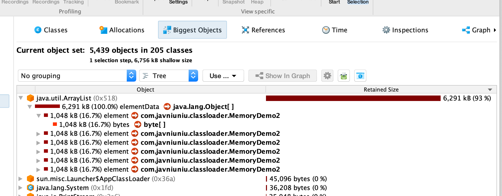

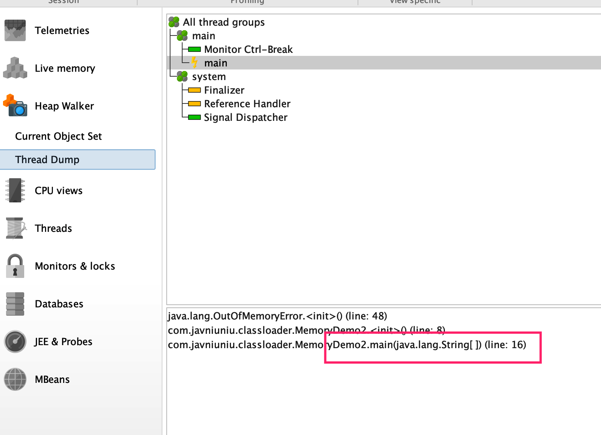


#### 13、GC

JVM 在进行GC时，并不是对这三个区域统一回收，大部分时候，回收都是在新生代

- 新生区
- 幸存区
- 元空间

GC两种类型：轻GC 重GC

__GC题目__

- JVM的内存模型和分区-详细到每个区放什么？
- 堆里面的分区有哪些？Eden，from，to，老年区，说说他们的特点
- GC的算法有哪些？标记清除法，笔记压缩，复制算法，引用计算法，怎么用的？
- 轻GC和重GC分别在什么时候发生？


##### 1、引用计算法

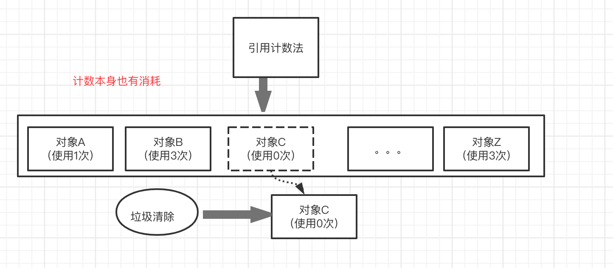


##### 2、复制算法

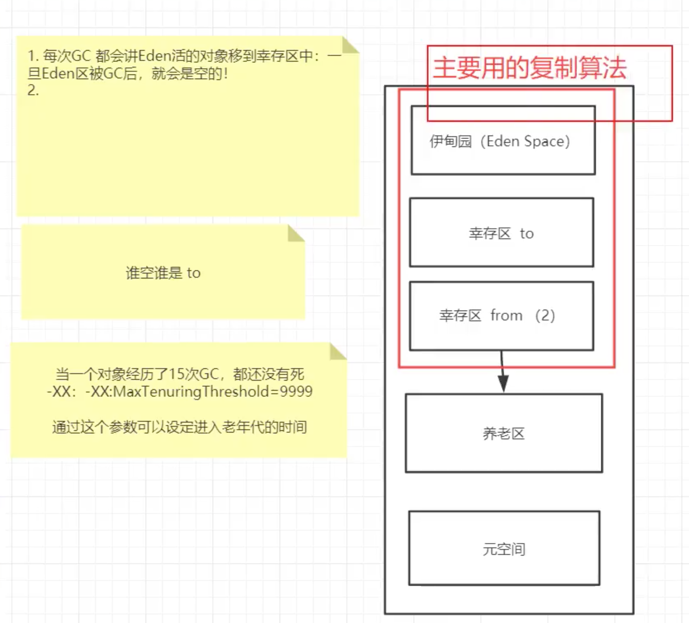

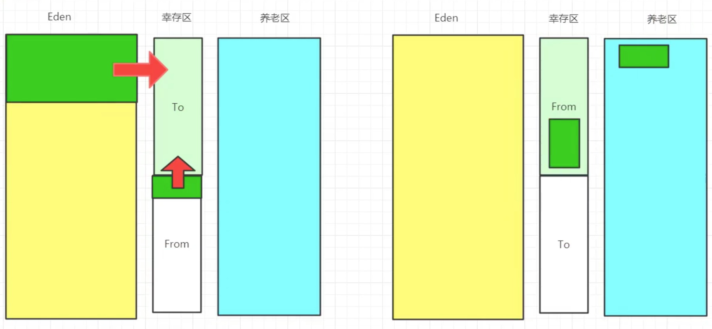

__好处：没有内存碎片__

__坏处：浪费内存空间__

复制算法最佳使用场景：对象存活度较低的情况下


##### 3、标记清除算法

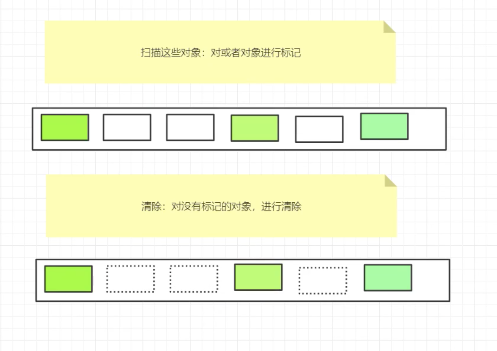

- 优点不需要额外的空间
- 缺点：两次扫描，严重浪费时间；会产生内存碎片


##### 4、标记压缩

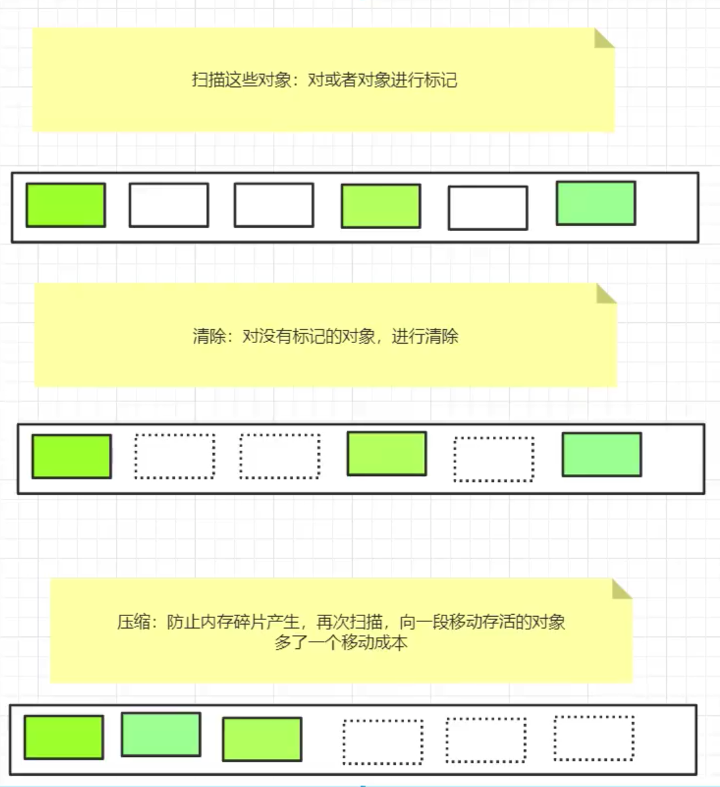

#####  总结

内存效率：复制算法 > 标记清除算法  > 标记压缩算法 （时间复杂度）

内存整齐度：复制算法 = 标记清除算法  > 标记压缩算法

内存利用率： 标记清除算法  > 标记压缩算法  >  复制算法


年轻代：

存活率低，适合使用 复制算法


老年代

区域大，存活率高，适合使用 标记清除算法  + 标记压缩算法 混合使用


GC 分代清除算法


#### 14、JMM

1. 什么是JMM

   (Java Memory Model的缩写)


2. 它是干嘛的？

   - 作用：缓存一致性协议，用于定义数据读写的规则

   - JMM定义了线程工作内存和主内存之间的抽象关系，线程之间的共享变量存储在主内存中，每个线程都有一个私有的本地内存
   - 解决共享对象可见效问题：Voliate


__内存交互操作有8种，虚拟机实现必须保证每一个操作都是原子的，不可在分的（对于double和long类型的变量来说，load、store、read和write操作在某些平台上允许例外）__

- lock   （锁定）：作用于主内存的变量，把一个变量标识为线程独占状态

- unlock （解锁）：作用于主内存的变量，它把一个处于锁定状态的变量释放出来，释放后的变量才可以被其他线程锁定

- read  （读取）：作用于主内存变量，它把一个变量的值从主内存传输到线程的工作内存中，以便随后的load动作使用

- load   （载入）：作用于工作内存的变量，它把read操作从主存中变量放入工作内存中

- use   （使用）：作用于工作内存中的变量，它把工作内存中的变量传输给执行引擎，每当虚拟机遇到一个需要使用到变量的值，就会使用到这个指令

- assign （赋值）：作用于工作内存中的变量，它把一个从执行引擎中接受到的值放入工作内存的变量副本中

- store  （存储）：作用于主内存中的变量，它把一个从工作内存中一个变量的值传送到主内存中，以便后续的write使用

- write 　（写入）：作用于主内存中的变量，它把store操作从工作内存中得到的变量的值放入主内存的变量中

  __JMM对这八种指令的使用，制定了如下规则：__

- 不允许read和load、store和write操作之一单独出现。即使用了read必须load，使用了store必须write

- 不允许线程丢弃他最近的assign操作，即工作变量的数据改变了之后，必须告知主存

- 不允许一个线程将没有assign的数据从工作内存同步回主内存

- 一个新的变量必须在主内存中诞生，不允许工作内存直接使用一个未被初始化的变量。就是怼变量实施use、store操作之前，必须经过assign和load操作

- 一个变量同一时间只有一个线程能对其进行lock。多次lock后，必须执行相同次数的unlock才能解锁

- 如果对一个变量进行lock操作，会清空所有工作内存中此变量的值，在执行引擎使用这个变量前，必须重新load或assign操作初始化变量的值

- 如果一个变量没有被lock，就不能对其进行unlock操作。也不能unlock一个被其他线程锁住的变量

- 对一个变量进行unlock操作之前，必须把此变量同步回主内存


---


#### 面试题

##### 1、请你谈谈你对JVM的理解？java8虚拟机和之前的变化和更新？

- ​	首先JVM由类装载器，运行时数据区域，执行引擎，本地接口库和本地方法库组成

##### 2、谈谈对类加载器的理解？

- 这里解释一下类加载机制，一般分为三个部分，__加载，连接，初始化__。
- 其中__连接又可分为验证__，准备，解析三个部分。加载阶段主要查找加载类的二进制文件。
- __验证阶段主要确保文件的正确性，准备阶段主要为静态变量分配内存，初始化默认值，解析阶段主要将符号引用转换为直接引用。__
- __初始化阶段__为类的静态引用赋予正确的初始值
- 类加载器可以分为三种：__根加载器，拓展类加载器，系统类加载器__。
- 既然说了三种类加载器就要提__双亲委托机制__。 除了顶层的类加载器之外，其余的类加载器都应有自己的父类加载器，如果一个类加载器收到了类加载请求，它首先不会自己去尝试加载这个类，而是把这个请求委派给父类加载器去完成，每一个层次的类加载器都是如此，因此所有的加载请求最终都应该传送到顶层的启动类加载器中，只有当父类加载器反馈自己无法完成加载这个请求（他的搜索范围中没有找到所需要的类时），子类加载器才会尝试自己去加载。


##### 3、运行时数据?

1. __方法区：__JVM的类装载器加载.class文件，把解析的类型信息放入方法区。
2. __堆：__是JVM中最大的一块内存区域，该区域的目的只是用于__存储对象实例及数组__
3. __java栈：__ 每个线程方法在执行时都会创建一个栈帧，__存放的为当前线程中局部基本类型的变量__，返回地址，__每个方法的执行与完成就对应的栈帧的入栈与出栈过程__
4. __本地方法栈：__用于支持native方法的执行，存储了每个native方法调用的状态
5. __程序计数器：__他是一个小内存空间，如果在执行一个java方法的时候，就记录正在执行的虚拟机字节码指令的地址


##### 4、java语言运行的过程

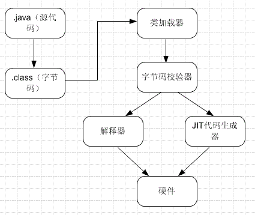
